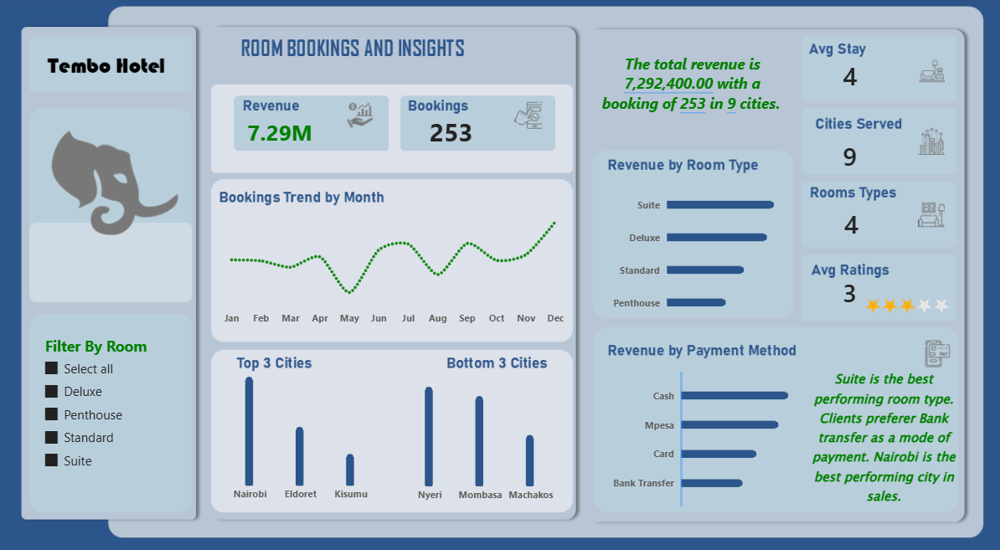

# Tembo Hotel Analytics: Relational Database Engineering & Business Intelligence Pipeline

Dashboard



Report I


An end-to-end data engineering and analytics solution that transforms raw, unorganized hotel operational records into an optimized SQL relational database, yielding key insights through an interactive Power BI dashboard.

## Business Problem
Tembo Hotel management struggled with fragmented booking records, untracked operational costs, and undefined occupancy trends. This lack of centralized visibility led to delayed reporting and revenue leakage from underpriced seasonal bookings.

## Project Objectives
* **Database Architecture:** Design and deploy a structured SQL relational schema eliminating data redundancy.
* **ETL Pipeline:** Extract, clean, and transform messy reservation logs using advanced SQL operations.
* **Analytics & BI:** Construct optimized business queries to uncover seasonal performance and present executive insights via Power BI.

## Tech Stack
* **Database Engine:** PostgreSQL
* **Data Transformation:** SQL (CTEs, Window Functions, Aggregations)
* **Business Intelligence:** Power BI (DAX, Star Schema Modeling)

## SQL Analytics Examples

### 1. Identifying Total Revenue, Revenue By Room Type and Payment Method
These queries calculat total revenue to assist leadership in identifying Key Performance Indicators in booking revenue.

```sql
-- total revenue
select 
	EXTRACT(MONTH FROM "check_in_date") as booking_month,
	sum(total_amount)  as revenue
from bookings
group by 
	EXTRACT(MONTH FROM "check_in_date")
order by EXTRACT(MONTH FROM "check_in_date") ;

-- total revenue by room
select 
	room_type,
	sum(total_amount)  as revenue
from bookings
group by room_type 
order by sum(total_amount) desc;

-- total revenue by payment method
select 
	payment_method,
	sum(total_amount) as revenue
from bookings
group by payment_method 
order by sum(total_amount) desc;

```
## SQL Advance Analytics Examples

### 1. Identifying Month on Month Total Sales by Confirmed Booking Status
These queries calculates and compares total revenue by month and provides the Previous Month sales percentage using Common Table Expression (CTEs) and Window Function.

```sql
-- calculating Month on Month Sales %
with monthly_sales as (
select 
	to_char(check_in_date, 'Mon') as Sales_month,
	extract(month from check_in_date) as Month_No,
	sum(total_amount) as total_sales
from bookings
where booking_status = 'Checked Out'
group by
	to_char(check_in_date, 'Mon'),
	extract(month from check_in_date)
order by 
	extract(month from check_in_date)
),
previous_month_sales as (
select 
	sales_month,
	total_sales,
	lag(total_sales,1,total_sales) over ()as prev_month_sales
from monthly_sales
)
select *,
		round((total_sales-prev_month_sales)/prev_month_sales * 100,2) as MoM_Sales_Pcnt
from previous_month_sales as pm;
```
Output


## Key Business Insights & Deliverables
* **Peak Revenue Drivers:** Suite and Dulex room types accounted high total revenue.
* **Cancellation Analysis:** Pinpointed a 15% cancellation pattern during specific peak periods, suggesting a requirement for stricter booking deposit policies.

## How to Replicate This Project
1. Clone the repository: `git clone https://github.com/iganabrian/Tembo-Hotel-SQL-Capstone-project.git`
2. Open `https://github.com/iganabrian/Tembo-Hotel-SQL-Capstone-project/blob/master/Power%20BI%20Dashboard/tembo_hotel_dashbord.pbix` to explore the dashboard.
