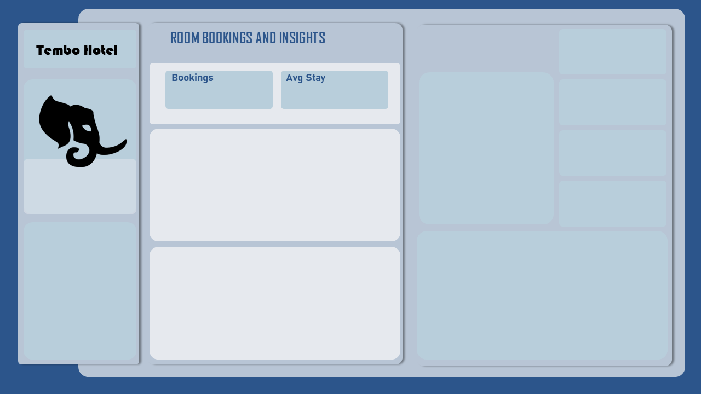
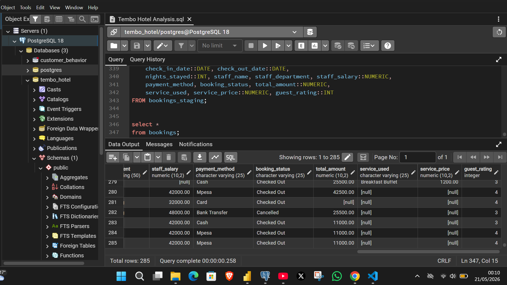

This is a capstone project that I am working on. I will be updating the repository as I go on.

The dataset in completely clean, I have created a connection with my powerBI. 

I will be working on the business questions on SQL, then do them again on power BI. 

Here is where the dashboard will be displayed using power power BI.

here is the display of clean data in Postgres.

here is the connected dataset from Postgres to Power BI. 

