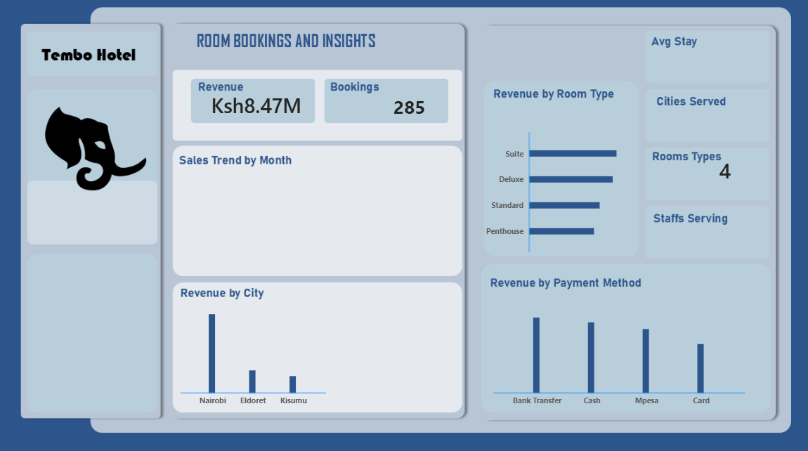

This is a capstone project that I am working on. I will be updating the repository as I go on.

The dataset in completely clean, I have created a connection with my powerBI. 

I will be working on the business questions on SQL, then do them again on power BI. 

Here is where the dashboard will be displayed using power power BI.



## Key Performance Indicators

- Total revenue by month

```SQL
 *		-- total revenue by month, by room, by payment method

-- total revenue
select 
	EXTRACT(MONTH FROM "check_in_date") as booking_month,
	sum(total_amount)  as revenue
from bookings
group by 
	EXTRACT(MONTH FROM "check_in_date")
order by EXTRACT(MONTH FROM "check_in_date") ;

```


- Total revenue by room type
```sql
-- total revenue by room
select 
	room_type,
	sum(total_amount)  as revenue
from bookings
group by room_type 
order by sum(total_amount) desc;
```


- Total Revenue by Paymenth Method

```sql 
--total revenue by payment method
select 
	payment_method,
	sum(total_amount) as revenue
from bookings
group by payment_method 
order by sum(total_amount) desc;

```

